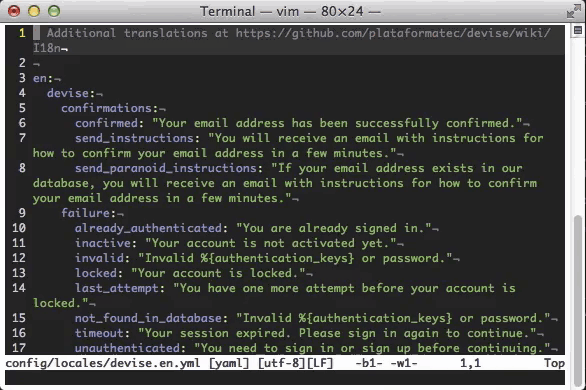

vim-rails-locale-alternate
==========================

Makes it easier to open alternate Rails locale files. While editing a locale
file, you may want to reference the translations of another language. This
plugin provides commands to open a different language version of the current
locale file in a separate window.

## Demo

## License
Copyright © 2018 Teddy Wing. Licensed under the GNU GPLv3+ (see the included
COPYING file).
